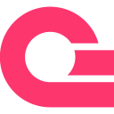
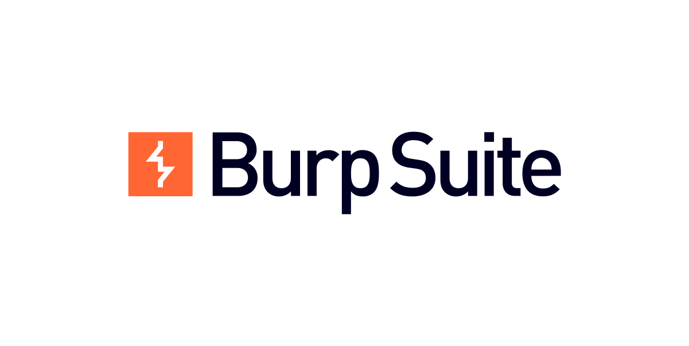

I build fast, secure, production-grade software that makes an impact. Currently on a journey to become one of the best technologists in the world by delivering quality software. I believe great technology is built on three pillars: security, scalability, and user experience. Every project I take on is guided by those principles.
I thrive in environments where I can solve problems, learn fast, and collaborate with people who dream big.

<h1 align="center">Valuable skills</h1>

<b>System Architecture & Scalability</b>

 
> I design systems that don’t break when real users show up. From microservices to event-driven architectures, I build platforms that scale smoothly, stay reliable under pressure, and remain easy to evolve as the product grows.

<b>AI-driven development</b>

 
> I specialize in leveraging AI to streamline routine processes such as generating commit messages, writing automated
> tests, producing documentation, and managing code reviews and pull requests.

<b>Security-First Engineering</b>

 
> Every system I build is designed with security at the core — not as an afterthought.
> I actively guard against vulnerabilities like SQL injection, XSS, broken authentication, misconfigurations, insecure APIs, and flawed permission models.

<!--

<b>Backend engineering</b>

> I am passionate about building secure, scalable, and high-performance systems. I focus on designing efficient APIs,
> optimizing databases, and creating robust architectures that power seamless user experiences. Always learning, always building.

<h1 align="center">Knowledge matrix</h1>
  

    
<h2>Languages</h2>

      &nbsp;
      &nbsp;
      &nbsp;
      &nbsp;
      &nbsp;
      
  

  

    
<h2>Frontend</h2>

    &nbsp;
    &nbsp;
    &nbsp;
    &nbsp;
    &nbsp;
    &nbsp;
    &nbsp;
    &nbsp;
  

  

    
<h2>Backend</h2>

    &nbsp;
    &nbsp;
    &nbsp;
  

  

    
<h2>Database</h2>

    &nbsp;
    &nbsp;
    &nbsp;
    &nbsp;
    
  

  

    
<h2>Security</h2>
 
    &nbsp;
        
  

  

    
<h2>Tools</h2>

    &nbsp;
    &nbsp;
    &nbsp;
    
  

-->
<h1 align = "center">My Stats:</h1>

 

<table>
  <tr>
    <td width="30%" align = "top">
        
    </td>

   <td width="35%" align = "center">
      
    </td>
<!--
   <td width="35%" align="center">
        
    </td>
    -->
  </tr>
</table>

